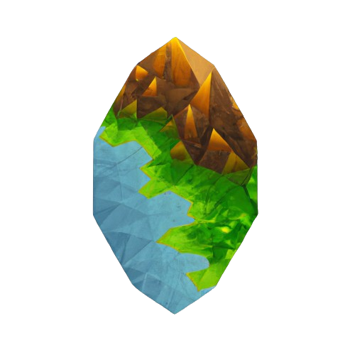

  

# 🎧 OxAg world generator
This is a world generator on steroids ^^

## Main features
#### 💠 Extremely customisable
It comes packed with tons of configuration options:
- tile type levels which allow you to have specific distributions of tile types
- auto tile type selection based on closest range if no level was provided
- you're able to set the content minimum and maximum spawn number & whether it spawns in batches or randomly 
- random environmental conditions generator

#### 💠 River, Street, Maze & lava pots generation
'cause why not

#### 💠 Seed support
This generator accepts seeds as inputs so that you'll never lose your favourite generated worlds.

#### 💠 Serialization support
Once you find the world you like you can `.save(path)` `.load(path)` to make sure the next time it's the same one  

#### 💠 Cool presets
You'll find plenty of cool presets that can be used to generate unique worlds.

## Examples
You can find multiple examples under the `/examples` folder!

## Support & Feedback
Feel free to [open an issue](https://github.com/xupremix/oxagworldgenerator/issues) if either you have suggestions, think that something is missing or something is broken!

# TODOS:
- [ ] add new presets  
- [ ] fix documentation `cargo doc --open`
- [ ] make the tests `cargo test`
- [ ] improve logic by maybe using parallel iterators etc...
- [ ] transmit the progress bar to an event handler - if specified
- [ ] run clippy fix for the lib warning `cargo clippy --fix`
- [ ] check for memory allocation (and if there are any improvements)